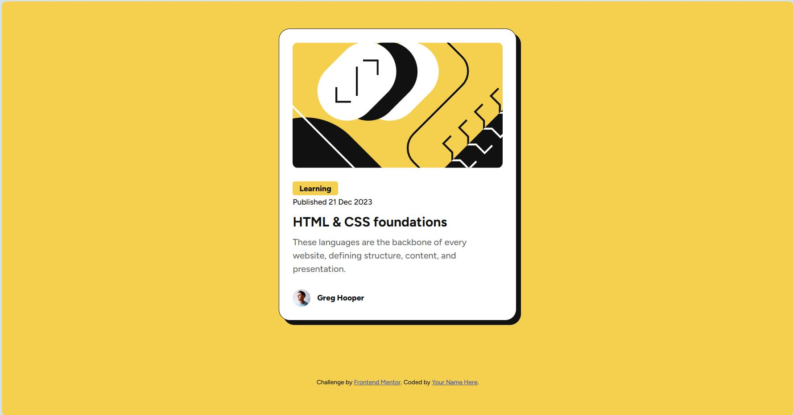

# Frontend Mentor - Blog preview card solution

This is a solution to the [Blog preview card challenge on Frontend Mentor](https://www.frontendmentor.io/challenges/blog-preview-card-ckPaj01IcS). Frontend Mentor challenges help you improve your coding skills by building realistic projects. 

## Table of contents

- [Overview](#overview)
  - [The challenge](#the-challenge)
  - [Screenshot](#screenshot)
  - [Links](#links)
- [My process](#my-process)
  - [Built with](#built-with)
  - [What I learned](#what-i-learned)
  - [Continued development](#continued-development)
  - [Useful resources](#useful-resources)
- [Author](#author)

## Overview
Responsive blog preview card using HTML and CSS

### The challenge

Users should be able to:

- See hover and focus states for all interactive elements on the page

### Screenshot

### Links

- Solution URL: [https://github.com/monicaivanov/blog-preview-card-main]
- Live Site URL: [https://monicaivanov.github.io/blog-preview-card-main/]

## My process

HTML structure. Set CSS variables, global settings, next structure the doc in CSS, add styles, write documentation and fine tune.

### Built with

- Semantic HTML5 markup
- CSS custom properties
- Flexbox
- CSS Grid

### What I learned

To use Figma as a guide to translate it into code.

### Continued development

To progressivly improve my skills and learn better ways to make choices. To get used to code mobile first. To better understand HTML sematic choices.

### Useful resources

- [How to name your CSS variables](https://www.fixate.it/blog/make-your-css-variable-names-suck-less) - This helped me remmeber how to name my CSS variables.

- [CSS file best practises](https://medium.com/@paulohfev/css-best-practices-you-should-know-374c388a00dd) - This is an amazing article which helped me summarize the best practises when writing your CSS file 

-[Writing media queries](https://css-tricks.com/a-complete-guide-to-css-media-queries/) - This article helped me remmeber how to write media queries

-[Using flexbox and grid](https://www.joshwcomeau.com/css/interactive-guide-to-flexbox/)

## Author

- Frontend Mentor - [@monicaivanov](https://www.frontendmentor.io/profile/monicaivanov)

